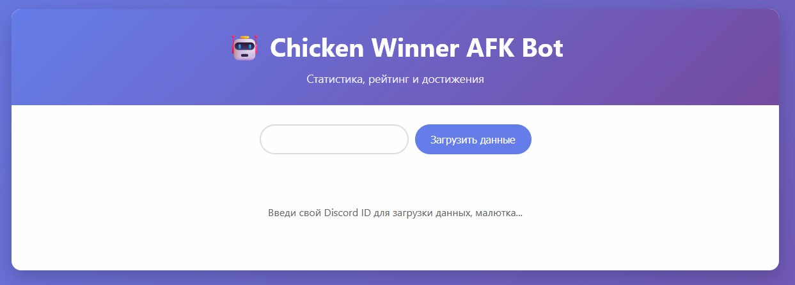
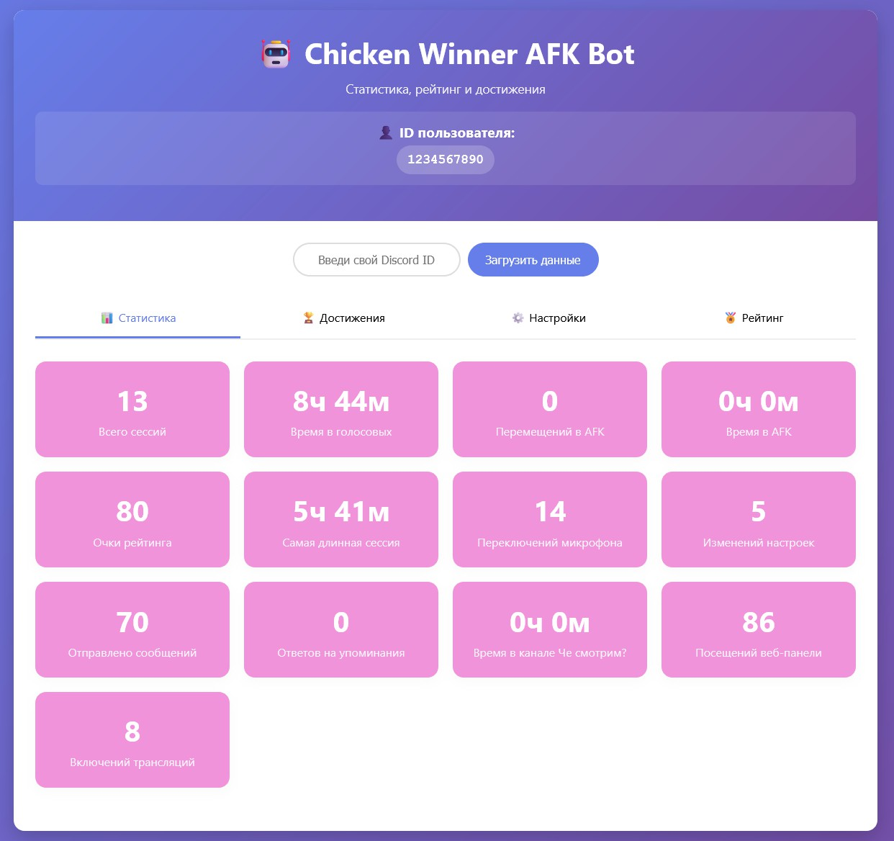
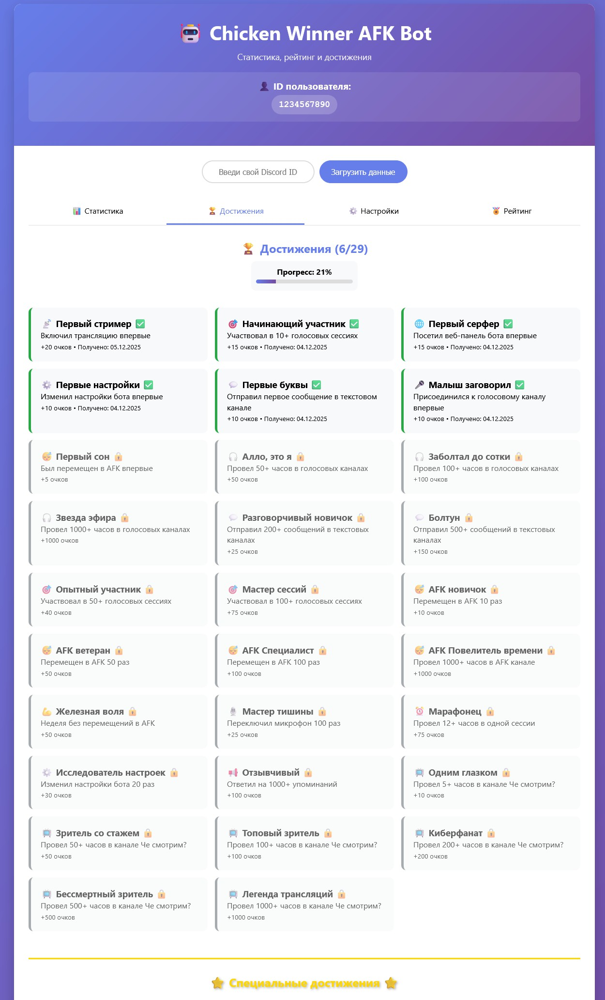
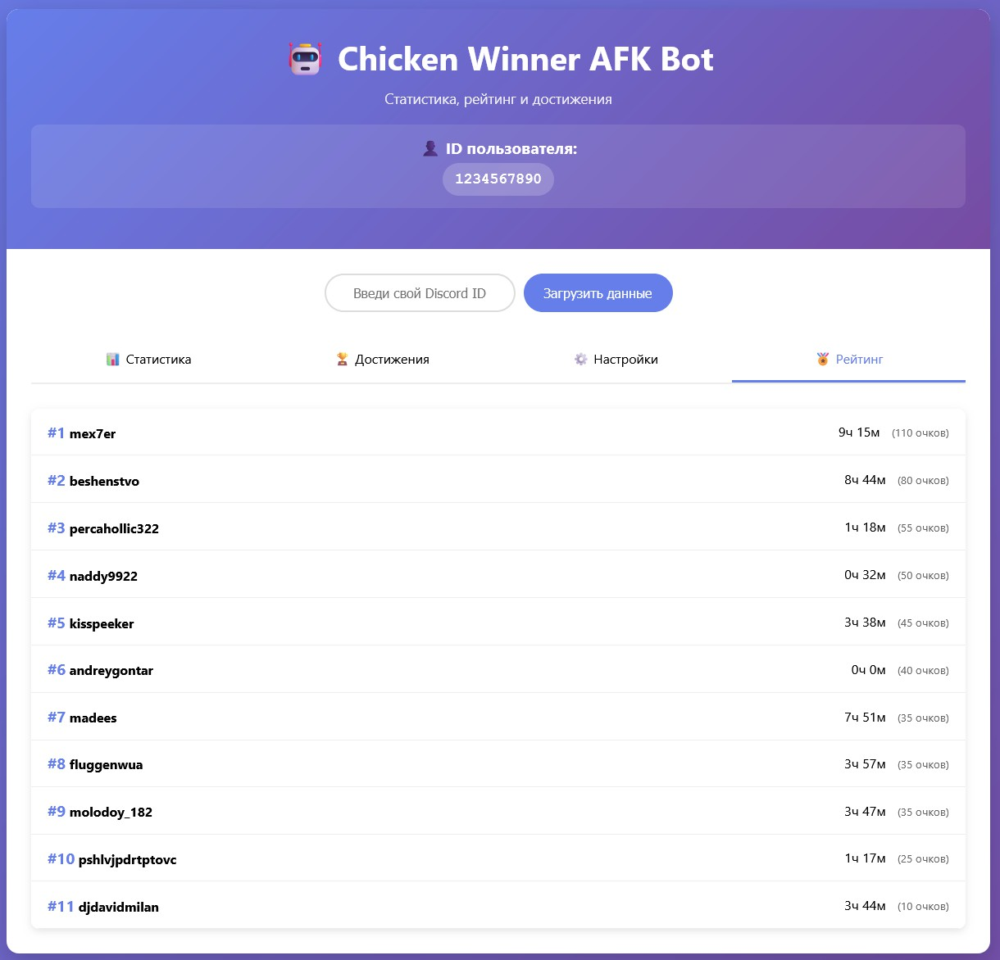

# 🤖 Chicken Winner AFK Discord Bot



## 📝 Описание

**Chicken Winner AFK Bot** - это многофункциональный Discord бот для отслеживания активности пользователей в голосовых каналах, системы достижений и веб-панели администратора.

## ✨ Основные возможности

### 🎧 Отслеживание голосовой активности

- Мониторинг времени в голосовых каналах
- Автоматическое перемещение AFK пользователей
- Подсчет сессий и статистики



### 🏆 Система достижений

- 25+ уникальных достижений
- Специальные достижения для особых событий
- Уведомления в Discord канале и личные сообщения
- Создание пользовательских достижений через веб-панель



### 📊 Веб-панель администратора

- Просмотр статистики пользователей
- Рейтинговая система
- Управление настройками
- Создание новых достижений



### 📈 Рейтинговая система

- Очки за достижения
- Топ активных пользователей
- Детальная статистика по каждому пользователю


## 🚀 Установка и настройка

1. **Клонирование репозитория:**

```bash
git clone https://github.com/Vidrimers/Chicken-Winner-AFK-Discord-Bot.git
cd Chicken-Winner-AFK-Discord-Bot
```

2. **Установка зависимостей:**

```bash
npm install
```

3. **Настройка окружения:**

```bash
cp .env.example .env
# Отредактируйте .env файл с вашими токенами
```

4. **Запуск бота:**

```bash
npm start
```

### Переменные окружения (.env)

Скопируйте `.env.example` в `.env` и заполните своими значениями:

````bash
# Discord Bot Configuration
DISCORD_TOKEN=your_discord_bot_token_here
GUILD_ID=your_guild_id_here
AFK_CHANNEL_ID=your_afk_channel_id_here
STREAM_CHANNEL_ID=your_stream_channel_id_here
ACHIEVEMENTS_CHANNEL_ID=your_achievements_channel_id_here

# Server Configuration
SERVER_IP=localhost

# Telegram Bot Configuration (Optional)
TELEGRAM_BOT_TOKEN=your_telegram_bot_token_here
TELEGRAM_CHAT_ID=your_telegram_chat_id_here
````

### Настройки бота

- **AFK Timeout:** Время бездействия до перемещения в AFK (15-45 минут)
- **DM Notifications:** Включение/отключение личных уведомлений
- **Achievement Notifications:** Уведомления о достижениях

## 🎯 Достижения

Бот включает множество достижений:

### 🎤 Голосовые достижения

- **Малыш заговорил** - Первое присоединение к голосовому каналу
- **Алло, это я** - 50+ часов в голосовых каналах
- **Заболтал до сотки** - 100+ часов в голосовых каналах
- **Звезда эфира** - 1000+ часов в голосовых каналах

### 😴 AFK достижения

- **Первый сон** - Первое перемещение в AFK
- **AFK новичок** - 10 перемещений в AFK
- **AFK ветеран** - 50 перемещений в AFK
- **AFK Специалист** - 100 перемещений в AFK

### 💬 Социальные достижения

- **Первые буквы** - Первое сообщение
- **Разговорчивый новичок** - 200+ сообщений
- **Болтун** - 500+ сообщений
- **Отзывчивый** - 1000+ ответов на упоминания

## 🌐 Веб-панель

Доступна по адресу: `http://localhost:3000`

### Возможности:

- 📊 Просмотр статистики пользователей
- 🏆 Список достижений
- ⚙️ Настройки уведомлений
- 🏅 Рейтинг пользователей
- 🎯 Создание пользовательских достижений (только для админа)

## 📊 Отслеживаемая статистика

- **Время в голосовых каналах**
- **Количество сессий**
- **Время в AFK**
- **Перемещения в AFK**
- **Отправленные сообщения**
- **Переключения микрофона**
- **Время трансляций**
- **Посещения веб-панели**
- **Изменения настроек**
- **Очки рейтинга**

## 🛠 Технологии

- **Node.js** - Серверная платформа
- **Discord.js** - Библиотека для работы с Discord API
- **sqlite3** - База данных
- **Express.js** - Веб-сервер
- **HTML/CSS/JavaScript (Vanilla)** - Веб-панель (без использования фреймворков)

## 📝 Лицензия

Этот проект распространяется под лицензией MIT.

## 👥 Авторы

- **Vidrimers** - Основной разработчик

## 📞 Поддержка

Если у вас есть вопросы или проблемы, создайте issue в этом репозитории.

---

**🐔 Chicken Winner AFK Bot** - ваш надежный помощник для управления Discord сервером!
